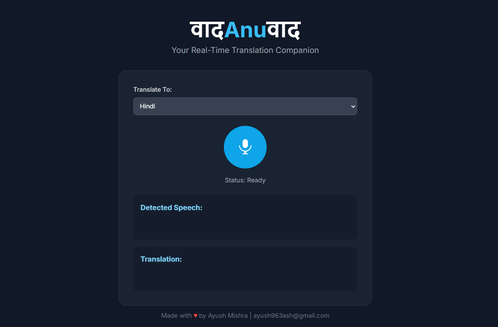

Real-Time Translation Companion

A functional web application that serves as a prototype for real-time, in-browser speech-to-text transcription and instant translation.

**Problem Statement** 
Breaking down language barriers for travelers and individuals communicating with people who speak a different language.

**✨ Core Functions** 
This application provides a seamless and intuitive interface for instant communication across languages.

Real-Time Transcription: Utilizes the browser's built-in Web Speech API to capture and convert spoken words into text as you speak.

Instant Translation: Transcribed text is sent to a backend server via WebSockets for immediate translation into the user's selected target language.

Multi-Language Support: Includes a wide range of popular Indian and foreign languages to choose from.

Mobile-First Design: A clean, responsive user interface built with Tailwind CSS ensures a great experience on both desktop and mobile devices.

Progressive Web App (PWA): Can be easily "installed" on a mobile device's home screen for an app-like experience.

**🛠️ Tech Stack** 
This project uses a modern, efficient stack to handle real-time communication between the client and the server.

**Frontend** 
HTML5

Tailwind CSS for styling.

JavaScript (Vanilla) for client-side logic.

Web Speech API for in-browser speech recognition.

**Backend** 
Python 3

FastAPI for creating the high-performance API.

WebSockets for persistent, low-latency, bi-directional communication.

Uvicorn as the ASGI server.

googletrans library for the translation service.

**Deployment** 
Backend: Deployed on Render.

Frontend: Deployed on Netlify.

**🚀 Future Scalability & Improvements** 
This prototype serves as a strong foundation. Future enhancements could include:

Upgrading the Translation Service: Integrating a more robust, production-grade API like the official Google Cloud Translate API or DeepL API to handle higher traffic and provide more accurate translations.

Text-to-Speech (TTS): Adding a feature to speak the translated text aloud, completing the conversational loop.

User Accounts: Implementing a system for users to sign in and save their translation history or preferred settings.

Automatic Source Language Detection: Removing the need to manually set the input language.

Native Mobile Applications: Developing dedicated Android (Kotlin) and iOS (Swift) apps for superior performance, offline capabilities, and deeper integration with the device's hardware.

Thanks to Auish
**Edited by ~ Elango**
uvicorn main:app --reload